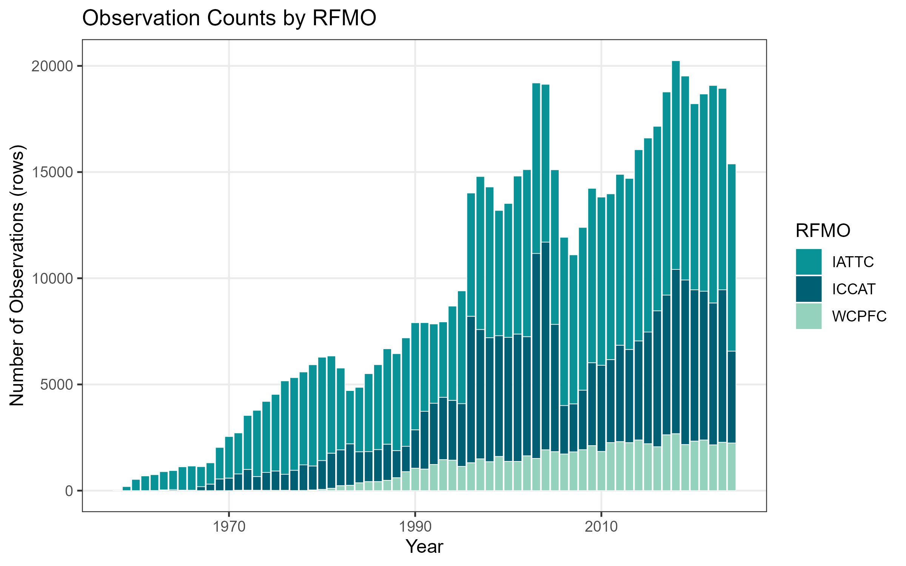
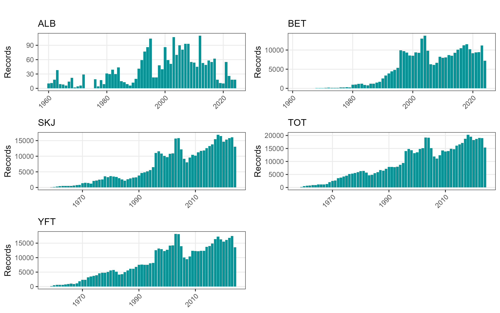
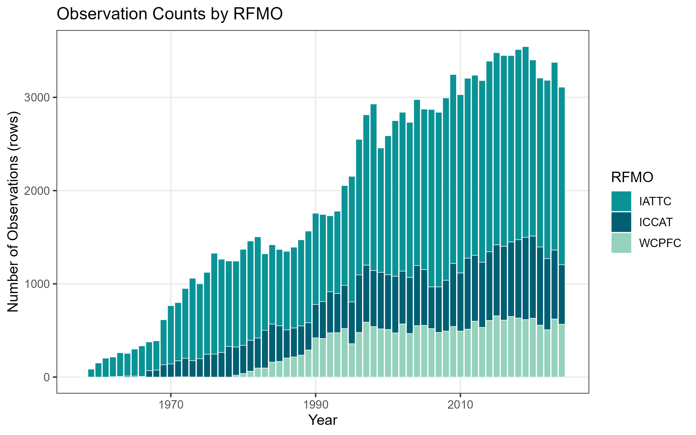

## How to cite:

[](https://doi.org/10.5281/zenodo.21494710)

Emily Rodriguez & Juan Carlos Villaseñor-Derbez. (2026). RFMO Tuna Catch and Effort Data (Version v0.0.0) [Dataset]. Zenodo. https://doi.org/10.5281/zenodo.21494710

# Tuna RFMO Data User Guide

This document provides an overview for users utilizing the harmonized tuna RFMO datasets in this repository. It explains what data are available, how they are structured, and how to load data.

## What these data are

This repository harmonizes publicly available catch and effort datasets from three major tuna Regional Fisheries Management Organizations (RFMOs):

- IATTC
- ICCAT
- WCPFC

Each RFMO publishes data in different formats, resolutions, and naming conventions. This repository standardizes them into a unified format so users can work with a single, consistent set of catch and effort datasets.

## Available datasets

Files located under `data/output/`

| Dataset                                 | Gear        | Spatial | Temporal | Temporal Coverage | Total Catch (mt) | By Flag | RFMOs Included      | Dataset                             | Formats        |
|-----------------------------------------|-------------|---------|----------|-------------------|------------------|---------|---------------------|-------------------------------------|----------------|
| `allrfmo_month_1deg_purseseine.rds`     | purse seine | 1°×1°   | month    | 1958-2024         | 64,848,155       | no      | IATTC, ICCAT, WCPFC | `allrfmo_month_1deg_purseseine`     | `.csv`, `.rds` |
| `allrfmo_year_1deg_purseseine.rds`      | purse seine | 1°×1°   | year     | 1958-2024         | 67,807,604       | no      | IATTC, ICCAT, WCPFC | `allrfmo_year_1deg_purseseine`      | `.csv`, `.rds` |
| `allrfmo_year_1deg_purseseine_flag.rds` | purse seine | 1°×1°   | year     | 1958-2024         | 54,633,092       | yes     | IATTC, ICCAT, WCPFC | `allrfmo_year_1deg_purseseine_flag` | `.csv`, `.rds` |
| `allrfmo_month_5deg_longline.rds`       | longline    | 5°×5°   | month    | 1950-2024         | 14,527,054       | no      | IATTC, ICCAT, WCPFC | `allrfmo_month_5deg_longline`       | `.csv`, `.rds` |
| `allrfmo_month_5deg_longline_flag.rds`  | longline    | 5°×5°   | month    | 1950-2024         | 13,113,173       | yes     | IATTC, ICCAT, WCPFC | `allrfmo_month_5deg_longline_flag`  | `.csv`, `.rds` |
| `allrfmo_year_5deg_longline.rds`        | longline    | 5°×5°   | year     | 1951-2024         | 10,944,941       | no      | IATTC, ICCAT, WCPFC | `allrfmo_year_5deg_longline`        | `.csv`, `.rds` |
| `allrfmo_year_5deg_longline_flag.rds`   | longline    | 5°×5°   | year     | 1951-2024         | 11,134,893       | yes     | IATTC, ICCAT, WCPFC | `allrfmo_year_5deg_longline_flag`   | `.csv`, `.rds` |


### Additonal length data

Files located under `data/output/`

| Dataset             | Gear  | Spatial | Temporal | Temporal Coverage | By Flag | RMFOs Included | Formats        |
|---------------------|-------|---------|----------|-------------------|---------|----------------|----------------|
| `wcpfc_length_data` | multi | 5°×5°   | multi    | 1953-2025         | no      | WCPFC          | `.csv`, `.rds` |

## Available variables for catch and effort data

| Variables        | Description                                                  |
|------------------|--------------------------------------------------------------|
| `rfmo`           | Related RFMO                                                 |
| `flag`           | Flag code in ISO 3166-1 alpha-3 (excluding `SUN`)            |
| `lon`            | Longitude of fishing activity                                |
| `lat`            | Latitude of the fishing activity                             |
| `year`           | Year of record                                               |
| `month`          | Month of record                                              |
| `effort_set`     | Number of fishing sets                                       |
| `effort_day`     | Number of fishing days                                       |
| `effort_t_hooks` | Thousands of hooks                                           |
| `catch_tot`      | Total catch (mt)                                             |
| `catch_tot_mt`   | Total catch (mt) (for longline datasets)                     |
| `catch_tot_num`  | Total catch (numbers of tuna caught) (for longline datasets) |
| `catch_skj`      | Catch of skipjack tuna (mt)                                  |
| `catch_alb`      | Catch of albacore tuna (mt)                                  |
| `catch_bet`      | Catch of bigeye tuna (mt)                                    |
| `catch_yft`      | Catch of yellowfin tuna (mt)                                 |

## Additional variables specific to length datasets

| Variables    | Description                                                  |
|--------------|--------------------------------------------------------------|
| `tstrat`     | Temporal stratification                                      |
| `gear`       | Gear type                                                    |
| `species`    | Tuna species                                                 |
| `length_cm`  | Fish length in centimeters                                   |
| `length_bin` | Length class/bin in cm based on interval (e.g., 1,2 cm bins) |

## Downloading `.rds` data in R

The harmonized tuna RFMO datasets can be loaded directly into R from this GitHub repository without cloning the repository. The datasets for R are stored as `.rds` files in the `data/output/` directory.

To download a dataset:

1. Navigate to `data/output/` in the GitHub repository.
2. Select the dataset you want to use.
3. Copy the **Raw** file URL (not the regular GitHub webpage URL).
4. Pass the URL to `readRDS()` as shown below.

For example:

```{r}
raw_url <- "https://raw.githubusercontent.com/jcvdav/tuna_data/main/data/output/allrfmo_month_1deg_purseseine.rds"

tuna_data <- readRDS(url(raw_url))

head(tuna_data)
```

### Downloading `.csv` Data 

`.rds` files are recommended for R users, but `.csv` files are also available for Excel users. 

To download a `.csv` dataset to your computer:

1. Navigate to the `data/output/` directory in the GitHub repository.
2. Select the `.csv` file you would like to download.
3. Click the **Download raw file** button.
4. Save the file to your desired location on your computer.


## Dataset coverage and overviews

Descriptive temporal and spatial coverage

## Dataset Overviews

### Month, 1 x 1 degree, purse seine catch and effort

{fig-alt="Annual observation counts by RFMO"}
{fig-alt="Annual species availability"}

#### Spatial Coverage


### Year, 1 degree, purse seine catch and effort

{fig-alt="Annual observation counts by RFMO"}

### Year, 1 x 1 degree, purse seine catch and effort with flag data

### Month, 5 x 5 degree, longline catch and effort

### Month 5 x 5 degree, longline catch and effort with flag data

### Year, 5 x 5 degree, longline catch and effort

### Year, 5 x 5 degree, longline catch and effort with flag data

# User feedback

If you identify a bug, data issue, inconsistency, typo, or other problem, please open a GitHub issue and include as much detail as possible:

- **Location of the issue:** Specify the relevant file, dataset, or script.
- **Description of the problem:** Explain what problem you observed.
- **Reason for concern:** Describe why you believe this may be an issue (e.g., incorrect values, missing information, unclear documentation, incorrect filtering).


